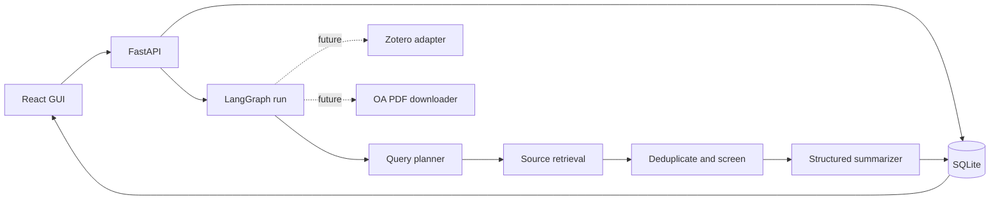

# Architecture

The backend owns task state and run state. The GUI never calls data providers directly. Each graph node receives structured state and returns a structured state update. Provider adapters and the model adapter are replaceable interfaces.

## State invariants

- Every paper has a stable canonical identifier.
- Every run records its current node, status, timestamps, and errors.
- Model output is validated against a JSON shape before persistence.
- A failed source does not fail the entire run.
- A paper is not exported to Zotero until a user review or explicit auto-save policy allows it.
