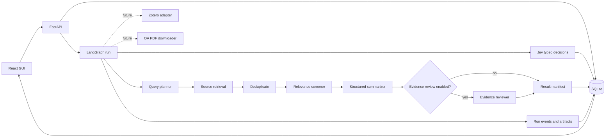

# Architecture

V2 separates orchestration (LangGraph), open-ended generation (OpenAI-compatible LLM), typed decisions (Jev), and deterministic execution. SQLite uses WAL; Alembic owns versioned schema upgrades; queued/running work is recovered by a bounded local worker after restart.

The backend owns task state and run state. The GUI never calls data providers directly. Each graph node receives structured state and returns a structured state update. Provider adapters and the model adapter are replaceable interfaces.

## State invariants

- Every paper has a stable canonical identifier.
- Every run records its current node, progress, status, timestamps, and errors.
- Every completed node writes a run event and one structured artifact.
- Every run uses a snapshot of the versioned prompt catalog available at startup.
- Model output is validated against a JSON shape before persistence.
- A failed source does not fail the entire run.
- A paper is not exported to Zotero until a user review or explicit auto-save policy allows it.
